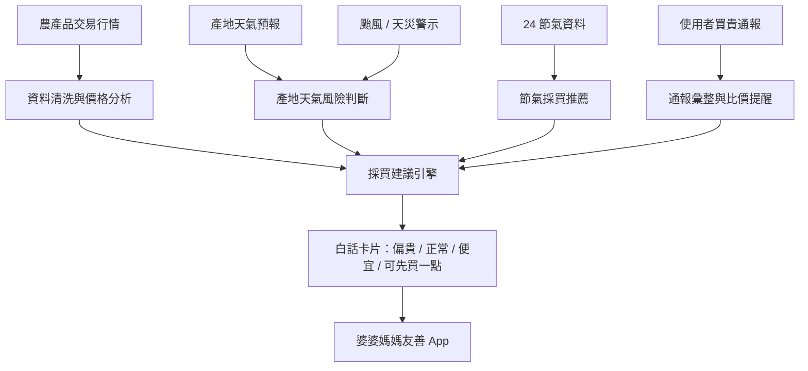
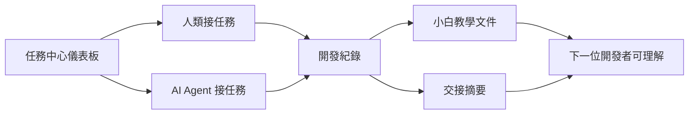
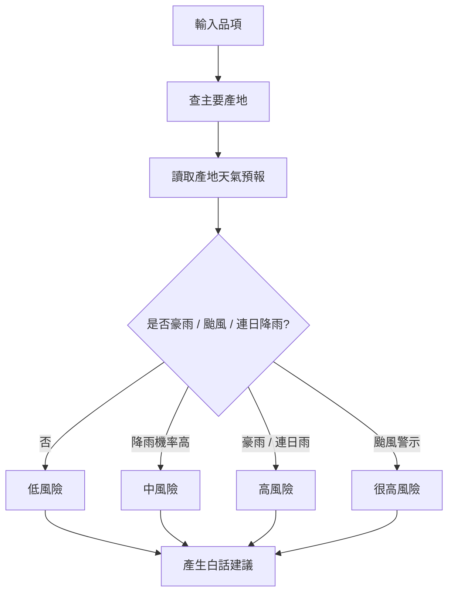
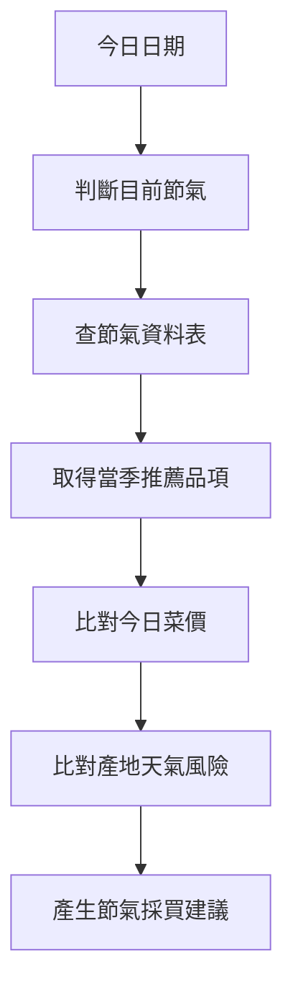

# SmartBuy AI｜便宜買 AI：產地天氣與菜價預警採買助手
# MVP 完整開發規格書 v1.1（含任務中心儀表板與 24 節氣智慧採買）

> 專案定位：給婆婆媽媽、家庭採買者、小吃店老闆使用的簡易菜價 App。  
> 核心精神：**前台簡單白話，後台智慧分析；人類與 AI Agent 可協作開發、可交接、可學習。**

---

## 0. 文件資訊

| 項目 | 內容 |
|---|---|
| 專案正式名稱 | SmartBuy AI｜便宜買 AI：產地天氣與菜價預警採買助手 |
| 文件版本 | MVP v1.1 |
| 本版重點 | 將「任務中心儀表板」列為 MVP 主要任務，並新增「農民曆 24 節氣智慧採買」設計 |
| 文件格式 | Markdown `.md` |
| 主要使用者 | 婆婆媽媽、家庭採買者、小吃店老闆、小型餐飲採購者 |
| 開發者設定 | 程式小白 + 六人小組 + AI Agent 協作 |
| 預設開發形式 | Streamlit Mobile Web App，後續可升級 PWA / FastAPI + Next.js |
| 主要資料來源 | 農業部農產品交易行情、中央氣象署天氣預報 / 警特報、24 節氣資料、使用者買貴通報 |
| 設計原則 | 大字體、大按鈕、少圖表、多白話卡片、流程可交接 |

---

# 1. 專案總覽

## 1.1 專案一句話說明

SmartBuy AI｜便宜買 AI 是一款結合**農產品交易行情、產地天氣預報、颱風 / 天災警示、24 節氣知識、菜價異常分析與買貴通報**的智慧採買助手，讓一般使用者不用懂資料分析，也能快速知道：

- 今天哪些菜偏貴？
- 哪些菜現在可以買？
- 產地下雨會不會讓菜價變高？
- 颱風來之前要不要先買一點？
- 現在是什麼節氣？適合買什麼？
- 如果買得比行情貴很多，能不能通報提醒別人？
- 開發者與 AI Agent 如何分工、記錄、交接？

---

## 1.2 專案核心價值

本專案不是單純的「查菜價網站」，而是：

```text
資料分析後台 + 白話採買前台 + 人類 × AI Agent 協作任務中心
```

系統核心流程：



同時，因開發者包含程式初學者，MVP 必須建立：



---

# 2. 專案目標

## 2.1 使用者目標

| 使用者問題 | App 要提供的答案 |
|---|---|
| 今天菜貴不貴？ | 顯示偏貴 / 正常 / 便宜 |
| 哪些菜適合今天買？ | 顯示便宜推薦與節氣推薦 |
| 產地下雨會影響菜價嗎？ | 顯示產地天氣菜價預警 |
| 颱風來了要不要先買？ | 顯示理性備菜建議，不鼓勵恐慌囤貨 |
| 現在是什麼節氣？ | 顯示 24 節氣小知識與當季建議 |
| 某個菜太貴怎麼辦？ | 顯示替代品推薦 |
| 買得太貴怎麼辦？ | 可進行買貴通報 |
| 我不懂圖表怎麼辦？ | App 用大字體白話卡片，不直接丟 3-Sigma、UCL、LCL 給使用者 |

---

## 2.2 開發者目標

| 開發者問題 | 系統要提供的答案 |
|---|---|
| 我是程式小白，不知道誰在做什麼 | 任務中心顯示所有任務、負責人、狀態 |
| AI Agent 改了什麼，我看不懂 | 每個任務必須有開發紀錄與教學文件 |
| 多人協作怕互相覆蓋 | 任務中心列出分支、相關檔案、完成標準 |
| 下一個人接手不知道進度 | 每個任務必須有交接摘要 |
| 不知道任務算不算完成 | 每個任務都有完成標準 checklist |
| 不知道怎麼測試 | 每個任務都要寫測試方式 |
| 不知道 AI 為什麼這樣寫 | 教學文件需用白話說明設計理由 |

---

# 3. 目標使用者與使用情境

## 3.1 主要使用者

1. 家庭採買者  
2. 婆婆媽媽  
3. 小吃店老闆  
4. 便當店 / 小型餐飲業者  
5. 傳統市場採購者  
6. 職訓專題開發小組成員  
7. AI Agent / Codex / Gemini / Claude Code 等開發協作者  

---

## 3.2 一般使用者情境

### 情境 A：產地連日下雨

使用者打開 App，首頁顯示：

```text
雲林、彰化未來 2 天可能連日降雨。
葉菜類可能受影響，價格可能上漲。
建議今天可先買一點耐放蔬菜，葉菜類不要大量囤貨。
```

### 情境 B：颱風接近

```text
颱風可能影響南部與東部產地。
運輸與採收可能延遲。
建議提早準備 2～3 天用量，不要恐慌囤貨。
```

### 情境 C：24 節氣提醒

```text
今日節氣：小暑
天氣炎熱，瓜類與清爽蔬菜較適合。
今日推薦：絲瓜、苦瓜、冬瓜、地瓜葉。
如果葉菜產地下雨，建議少量購買。
```

### 情境 D：買到比行情貴很多

使用者在市場買到高麗菜 60 元 / 公斤，App 顯示市場行情約 38 元 / 公斤。  
使用者可按下「買貴通報」，填寫品項、價格、市場與照片，提醒其他使用者注意。

---

## 3.3 開發者情境

### 情境 E：AI Agent 完成任務

AI Agent 完成「產地天氣風險判斷模組」後，必須輸出：

```text
docs/dev_logs/TASK-006_weather_risk_log.md
docs/tutorials/TASK-006_weather_risk_tutorial.md
docs/handoff/TASK-006_weather_risk_handoff.md
```

讓下一位人類開發者知道：

- 做了什麼
- 改了哪些檔案
- 為什麼這樣設計
- 如何測試
- 下一步誰可以接手

---

# 4. MVP 功能範圍

MVP 分成兩大區：

```text
A. 使用者前台功能
B. 開發協作後台：任務中心儀表板
```

---

## 4.1 MVP 使用者前台功能

| 編號 | 功能 | 是否 MVP | 說明 |
|---|---|---|---|
| F01 | 今日菜價總覽 | 是 | 顯示常見品項偏貴 / 正常 / 便宜 |
| F02 | 產地天氣菜價預警 | 是 | 根據產地下雨、豪雨、連日降雨判斷菜價風險 |
| F03 | 颱風 / 天災警示 | 是 | 顯示颱風對產地與運輸的可能影響 |
| F04 | 菜價狀態分析 | 是 | 後台用 3-Sigma，前台顯示白話狀態 |
| F05 | 便宜推薦 | 是 | 推薦今日適合購買品項 |
| F06 | 替代品推薦 | 是 | 某品項偏貴時，推薦可替代食材 |
| F07 | 買貴通報 | 是 | 使用者回報買貴價格 |
| F08 | 我的菜籃 / 常買清單 | 是 | 收藏常買品項 |
| F09 | 搜尋菜價 | 是 | 搜尋品項並顯示價格狀態 |
| F10 | 手機友善 UI | 是 | 大字體、大按鈕、卡片式介面 |
| F11 | 24 節氣提醒卡 | 是 | 首頁顯示今日節氣與白話採買提醒 |
| F12 | 節氣推薦頁 | 是 | 顯示當季蔬果、節氣小知識、料理建議 |
| F13 | 節氣 × 菜價推薦 | 是 | 將當季品項與今日價格、產地天氣合併判斷 |

---

## 4.2 MVP 開發協作功能：任務中心儀表板

> **任務中心儀表板是 MVP 版主要開發任務，不可延後到進階版。**

| 編號 | 功能 | 是否 MVP | 說明 |
|---|---|---|---|
| T01 | 任務列表 | 是 | 顯示所有任務、狀態、負責人 |
| T02 | 任務詳情 | 是 | 顯示目標、相關檔案、完成標準 |
| T03 | 任務狀態 | 是 | 待認領 / 進行中 / 等待測試 / 需要修改 / 已完成 |
| T04 | 人類與 Agent 負責人欄位 | 是 | 標註人類、AI Agent 或共同協作 |
| T05 | 相關檔案清單 | 是 | 防止多人同時亂改相同檔案 |
| T06 | 完成標準 checklist | 是 | 明確定義任務完成條件 |
| T07 | 開發紀錄連結 | 是 | 連到 `docs/dev_logs/` |
| T08 | 教學文件連結 | 是 | 連到 `docs/tutorials/` |
| T09 | 交接摘要連結 | 是 | 連到 `docs/handoff/` |
| T10 | 任務篩選 | 是 | 依狀態、負責人、優先度篩選 |
| T11 | Agent 工作規則 | 是 | 定義 AI 接任務時必須輸出的文件 |

---

## 4.3 非 MVP 功能

以下功能可列為進階版，不放進第一版硬做：

| 功能 | 原因 |
|---|---|
| 使用者帳號系統 | MVP 可先用本機 / session / JSON 儲存 |
| 即時推播通知 | 需要額外推播服務，先用首頁提醒即可 |
| 原生手機 App | 第一版用 Streamlit / PWA 較穩 |
| 全台所有農產品完整預測 | MVP 先選核心品項 |
| 深度學習預測模型 | 先用規則 + baseline + RandomForest 即可 |
| 即時分鐘級價格 | 農產品交易行情通常不是分鐘級資料 |
| 複雜權限管理 | 任務中心 MVP 先不做登入權限 |

---

# 5. 系統資訊架構

## 5.1 前台頁面

```text
SmartBuy AI App
│
├── 首頁 Home
│   ├── 今日市場狀況
│   ├── 產地天氣提醒
│   ├── 24 節氣提醒卡
│   ├── 我的菜籃
│   ├── 今日便宜推薦
│   └── 漲價提醒
│
├── 搜尋菜價 Price Search
│   ├── 輸入菜名
│   ├── 今日價格
│   ├── 價格狀態
│   ├── 產地天氣風險
│   └── 替代品推薦
│
├── 節氣推薦 Solar Term Guide
│   ├── 今日節氣
│   ├── 節氣小知識
│   ├── 當季推薦蔬果
│   ├── 今日價格狀態
│   ├── 料理建議
│   └── 保存小提醒
│
├── 買貴通報 Price Report
│   ├── 品項
│   ├── 買入價格
│   ├── 市場 / 地點
│   ├── 選填照片
│   └── 通報成功提示
│
├── 我的菜籃 My Basket
│   ├── 常買品項
│   ├── 收藏品項
│   └── 每日提醒
│
└── 任務中心 Task Dashboard
    ├── 任務看板
    ├── 任務詳情
    ├── 開發紀錄
    ├── 教學文件
    └── 交接摘要
```

---

## 5.2 首頁 UX 草圖

```text
┌──────────────────────────────┐
│ SmartBuy AI｜便宜買 AI        │
│ 今天菜價幫你看好了           │
├──────────────────────────────┤
│ 🌿 今日節氣：小暑             │
│ 天氣炎熱，瓜類較適合購買     │
│ 推薦：絲瓜、苦瓜、冬瓜       │
├──────────────────────────────┤
│ 🌧 產地天氣提醒               │
│ 雲林、彰化可能下雨           │
│ 葉菜類可能變貴，可先買一點   │
├──────────────────────────────┤
│ 🛒 今日便宜推薦               │
│ 地瓜葉：正常，可購買         │
│ 香蕉：偏便宜，可購買         │
├──────────────────────────────┤
│ 🔍 搜尋菜名                   │
│ [高麗菜______________]        │
├──────────────────────────────┤
│ [買貴通報] [我的菜籃]         │
└──────────────────────────────┘
```

---

# 6. 資料來源設計

## 6.1 農產品交易行情資料

資料用途：

- 今日價格
- 近期平均價格
- 交易量
- 市場比較
- 偏貴 / 正常 / 便宜分析
- 便宜推薦
- 買貴通報比對基準

建議欄位：

| 欄位 | 說明 |
|---|---|
| trans_date | 交易日期 |
| crop_code | 作物代號 |
| crop_name | 作物名稱 |
| market_code | 市場代號 |
| market_name | 市場名稱 |
| upper_price | 上價 |
| middle_price | 中價 |
| lower_price | 下價 |
| avg_price | 平均價 |
| volume | 交易量 |

---

## 6.2 產地天氣資料

資料用途：

- 判斷主要產地是否下雨
- 判斷豪雨、颱風、連日降雨風險
- 預測菜價可能受影響的機率

建議欄位：

| 欄位 | 說明 |
|---|---|
| origin_area | 產地縣市 / 鄉鎮 |
| forecast_date | 預報日期 |
| rain_probability | 降雨機率 |
| weather_status | 天氣狀態 |
| warning_type | 警特報種類 |
| typhoon_risk | 颱風風險 |

---

## 6.3 品項與主要產地對照表

檔案：`data/mapping/product_origin_mapping.csv`

| 欄位 | 說明 |
|---|---|
| product_name | 品項名稱 |
| category | 類別 |
| main_origins | 主要產地，可用分號分隔 |
| origin_weight | 產地權重，可選 |
| note | 備註 |

範例：

```csv
product_name,category,main_origins,origin_weight,note
高麗菜,蔬菜,雲林;彰化;南投,0.4;0.3;0.3,示範資料，正式版需由資料來源確認
小白菜,蔬菜,雲林;嘉義;台南,0.4;0.3;0.3,示範資料
香蕉,水果,高雄;屏東;南投,0.4;0.4;0.2,示範資料
```

> 注意：MVP 可先建立示範對照表，但規格書需標明「正式上線前要補足資料來源與驗證」。

---

## 6.4 24 節氣資料

檔案：`data/calendar/solar_terms.csv`

用途：

- 判斷今日節氣
- 顯示節氣小知識
- 推薦當季蔬果
- 結合天氣與菜價產生生活化採買建議

欄位：

| 欄位 | 說明 |
|---|---|
| term_name | 節氣名稱 |
| season | 春 / 夏 / 秋 / 冬 |
| approx_month | 約略月份 |
| description | 節氣白話說明 |
| shopping_tip | 採買建議 |
| health_tip | 飲食 / 保存提醒 |
| common_products | 常見推薦品項 |
| risk_note | 可能風險 |

範例：

```csv
term_name,season,approx_month,description,shopping_tip,health_tip,common_products,risk_note
立春,春,2月,春天開始，氣溫逐漸回暖,可留意春季蔬菜與嫩葉類,飲食宜清爽,菠菜;青江菜;高麗菜,早春氣溫變化大
穀雨,春,4月,雨水增加，有利作物生長,可選擇當季葉菜與豆類,注意濕氣,空心菜;四季豆;青江菜,連日下雨可能影響葉菜價格
小暑,夏,7月,天氣炎熱，降雨與午後雷陣雨增加,可多選瓜類與耐放蔬菜,飲食宜清淡,絲瓜;苦瓜;冬瓜;地瓜葉,高溫與豪雨可能造成菜價波動
白露,秋,9月,早晚轉涼，秋季作物逐漸上市,可留意根莖類與秋季水果,注意溫差,地瓜;南瓜;梨子,颱風季仍可能影響供貨
冬至,冬,12月,天氣寒冷，適合溫補料理,可選耐煮蔬菜與根莖類,注意保暖,白蘿蔔;高麗菜;香菇,寒流可能影響部分蔬菜供應
```

---

## 6.5 節氣品項推薦表

檔案：`data/calendar/seasonal_products.csv`

| 欄位 | 說明 |
|---|---|
| product_name | 品項名稱 |
| best_terms | 適合節氣，分號分隔 |
| category | 蔬菜 / 水果 / 其他 |
| reason | 推薦理由 |
| suggested_cooking | 料理建議 |
| storage_tip | 保存建議 |

範例：

```csv
product_name,best_terms,category,reason,suggested_cooking,storage_tip
白蘿蔔,立冬;小雪;大雪;冬至,蔬菜,冬季常見且適合燉煮,蘿蔔湯;滷蘿蔔,可冷藏保存
絲瓜,芒種;夏至;小暑;大暑,蔬菜,夏季常見，適合清爽料理,絲瓜炒蛋;絲瓜湯,不宜久放
苦瓜,小暑;大暑;立秋,蔬菜,炎熱時節常見,苦瓜排骨湯;炒苦瓜,冷藏保存
高麗菜,霜降;立冬;小雪;大雪,蔬菜,涼季品質較穩定,炒高麗菜;高麗菜湯,冷藏可保存數日
香蕉,小滿;芒種;夏至,水果,夏季常見水果,直接食用;香蕉牛奶,避免悶熱
```

---

## 6.6 使用者買貴通報資料

檔案：`data/reports/price_reports.csv` 或 SQLite table `price_reports`

| 欄位 | 說明 |
|---|---|
| report_id | 通報 ID |
| report_date | 通報日期 |
| product_name | 品項 |
| user_price | 使用者買入價格 |
| unit | 單位 |
| market_name | 市場 / 地點 |
| photo_path | 選填照片 |
| official_avg_price | 官方行情平均價 |
| price_gap_rate | 與行情差距百分比 |
| status | 待確認 / 已採納 / 已封存 |

---

# 7. 核心分析邏輯

## 7.1 菜價狀態分析

後台可使用 3-Sigma 或移動平均判斷，但前台不得直接顯示「UCL / LCL / 標準差」。

後台：

```text
mean_price = 近 N 日平均價格
std_price = 近 N 日價格標準差
upper_limit = mean_price + 2 或 3 * std_price
lower_limit = mean_price - 2 或 3 * std_price
```

前台轉譯：

| 後台結果 | 前台顯示 |
|---|---|
| 今日價格高於上限 | 偏貴 |
| 今日價格低於下限 | 便宜 |
| 今日價格接近平均 | 正常 |
| 波動幅度大 | 最近價格不穩 |
| 資料不足 | 資料不足，僅供參考 |

---

## 7.2 產地天氣風險判斷

流程：



風險分級：

| 天氣狀況 | 風險 | App 顯示 |
|---|---|---|
| 無明顯降雨 | 低 | 產地天氣穩定 |
| 降雨機率高 | 中 | 產地下雨，菜價可能受影響 |
| 豪雨 / 連續多日降雨 | 高 | 產地大雨，葉菜可能變貴 |
| 颱風警報 | 很高 | 颱風可能影響採收與運輸，建議提前準備 |

---

## 7.3 24 節氣推薦邏輯



規則：

| 條件 | 建議文案 |
|---|---|
| 當季 + 價格正常 / 便宜 | 這個節氣適合購買，今天價格也合理，可以買 |
| 當季 + 產地天氣風險高 | 雖然是當季，但產地天氣不穩，建議少量購買 |
| 非當季 + 偏貴 | 不是現在最划算，可改買當季替代品 |
| 節氣遇到颱風 / 豪雨 | 可準備 2～3 天用量，不要大量囤貨 |

前台文案範例：

```text
今日節氣：穀雨
雨水增加，葉菜價格可能比較容易波動。
今天絲瓜價格正常，可以購買；小白菜產地有雨，建議少量購買。
```

---

## 7.4 買貴通報判斷

```text
price_gap_rate = (user_price - official_avg_price) / official_avg_price
```

| 差距 | 顯示 |
|---|---|
| <= 10% | 接近行情 |
| 10% ~ 30% | 稍高，購買前可多比較 |
| > 30% | 可能買貴，可通報提醒其他人 |

---

## 7.5 採買建議整合邏輯

綜合評分：

```text
採買建議 = 菜價狀態 + 產地天氣風險 + 颱風風險 + 節氣推薦 + 使用者通報
```

輸出狀態：

| 狀態 | 說明 |
|---|---|
| 推薦購買 | 價格正常或便宜，且天氣風險低 |
| 可少量購買 | 有天氣風險或價格略高 |
| 建議觀望 | 價格偏高或通報偏多 |
| 改買替代品 | 目前偏貴，且有適合替代品 |
| 資料不足 | 無足夠行情資料 |

---

# 8. 任務中心儀表板規格

## 8.1 任務中心定位

任務中心是給開發小組與 AI Agent 使用的後台，不是一般採買者的主要頁面。

目的：

```text
讓程式小白也能看懂任務、接任務、查紀錄、交接進度。
```

---

## 8.2 任務狀態

```text
待認領
進行中
等待測試
需要修改
已完成
已封存
```

---

## 8.3 任務資料格式

檔案：`data/tasks/tasks.json`

```json
[
  {
    "task_id": "TASK-001",
    "title": "建立首頁 UI",
    "status": "已完成",
    "owner": "B UI/UX 設計",
    "worker_type": "人類 + AI Agent",
    "priority": "高",
    "module": "frontend",
    "related_files": [
      "app/main.py",
      "app/components/price_card.py"
    ],
    "goal": "建立適合婆婆媽媽使用的大字體首頁。",
    "done_definition": [
      "首頁可以正常開啟",
      "顯示今日菜價提醒",
      "按鈕清楚可點",
      "手機版排版正常",
      "完成教學文件"
    ],
    "dev_log": "docs/dev_logs/TASK-001_home_ui_log.md",
    "tutorial_doc": "docs/tutorials/TASK-001_home_ui_tutorial.md",
    "handoff_note": "docs/handoff/TASK-001_home_ui_handoff.md"
  }
]
```

---

## 8.4 任務中心 UI 草圖

```text
┌──────────────────────────────────────┐
│ 任務中心 Human-Agent Task Dashboard  │
├──────────────────────────────────────┤
│ 篩選：狀態 [全部▼] 負責人 [全部▼]    │
├──────────┬──────────┬──────────┬─────┤
│ 待認領   │ 進行中   │ 等待測試 │ 完成│
├──────────┼──────────┼──────────┼─────┤
│ TASK-011 │ TASK-006 │ TASK-003 │ 001 │
│ 節氣頁   │ 天氣風險 │ 資料清洗 │ 首頁│
├──────────┴──────────┴──────────┴─────┤
│ 任務詳情：TASK-006                  │
│ 目標：建立產地天氣風險判斷          │
│ 相關檔案：src/weather/...            │
│ 完成標準：□ 可查產地 □ 可產生建議   │
│ 文件：開發紀錄 / 教學文件 / 交接摘要│
└──────────────────────────────────────┘
```

---

## 8.5 任務中心 MVP 頁面

檔案：`app/pages/99_task_dashboard.py`

功能：

- 讀取 `data/tasks/tasks.json`
- 顯示任務列表
- 依狀態、負責人、模組篩選
- 顯示任務詳情
- 顯示完成標準 checklist
- 顯示相關檔案
- 顯示教學文件、開發紀錄、交接摘要路徑

---

# 9. AI Agent 開發規則

每個 AI Agent 接任務時，必須遵守：

```text
1. 先讀 README.md、docs/SPEC.md、data/tasks/tasks.json。
2. 只修改任務相關檔案。
3. 不得大幅重構未指定的模組。
4. 修改後列出新增 / 修改檔案。
5. 必須提供測試方式。
6. 必須產生開發紀錄。
7. 必須產生小白教學文件。
8. 必須產生任務交接摘要。
9. 完成後更新 tasks.json 狀態。
```

---

## 9.1 Agent 任務提示語模板

```md
# AI Agent 任務指令

你現在是 SmartBuy AI｜便宜買 AI 專案的開發 Agent。

本專案開發者包含程式初學者，因此你完成任何功能時，都必須留下清楚、白話、可交接的紀錄。

## 任務名稱

請完成：{任務名稱}

## 任務目標

{任務目標}

## 開發規則

1. 先閱讀 README.md、docs/SPEC.md、data/tasks/tasks.json。
2. 只修改與本任務相關的檔案。
3. 不得大幅重構未指定的模組。
4. 每次修改後，必須列出新增與修改的檔案。
5. 必須提供測試方式。
6. 必須產生開發紀錄。
7. 必須產生小白教學文件。
8. 必須產生任務交接摘要。
9. 完成後更新任務中心狀態。

## 必須輸出

- `docs/dev_logs/{task_id}_log.md`
- `docs/tutorials/{task_id}_tutorial.md`
- `docs/handoff/{task_id}_handoff.md`

## 教學文件要求

- 新手看得懂
- 避免過度專業術語
- 必要時用流程圖
- 說明為什麼這樣做
- 說明如何測試
- 說明下一位開發者如何接手
```

---

# 10. 教學文件與交接文件規格

## 10.1 開發紀錄模板

路徑：`docs/dev_logs/{task_id}_log.md`

```md
# {task_id} 開發紀錄：{任務名稱}

## 1. 任務目標

## 2. 開發前狀態

## 3. 本次修改內容

### 新增檔案

### 修改檔案

## 4. AI Agent / 人類做了什麼？

## 5. 為什麼這樣設計？

## 6. 測試方式

## 7. 測試結果

## 8. 下一步交接
```

---

## 10.2 小白教學文件模板

路徑：`docs/tutorials/{task_id}_tutorial.md`

```md
# {task_id} 教學文件：{任務名稱}

## 1. 這個功能是做什麼的？

## 2. 為什麼 App 需要這個功能？

## 3. 這次新增或修改了哪些檔案？

## 4. 功能流程圖

```text
輸入資料
  ↓
處理邏輯
  ↓
輸出結果
```

## 5. 程式白話解釋

## 6. 怎麼測試？

## 7. 預期看到什麼結果？

## 8. 下一步可以怎麼做？
```

---

## 10.3 交接摘要模板

路徑：`docs/handoff/{task_id}_handoff.md`

```md
# {task_id} 交接摘要：{任務名稱}

## 已完成

## 尚未完成

## 已知問題

## 下一位建議接手者

## 接手前必讀檔案

## 測試指令
```

---

# 11. 六人分工

| 成員 | 角色 | 負責方向 | 主要產出 | 新增共同責任 |
|---|---|---|---|---|
| A | 組長 / 產品設計 | 功能範圍、Git、整合、任務中心管理 | SPEC、README、任務清單、Demo 流程 | 審核任務與交接文件 |
| B | UI / UX 設計 | 手機介面、大字體、卡片、節氣頁 | Home、Search、Solar Term UI | 每完成畫面要寫 UI 教學文件 |
| C | 資料工程 | 農產資料、天氣資料、節氣資料、資料清洗 | SQLite / CSV、data_loader | 每完成資料流程要寫資料教學 |
| D | 菜價狀態分析 | 3-Sigma、偏貴 / 正常 / 便宜、風險等級 | price_status.py | 用白話解釋分析邏輯 |
| E | AI 預測 / 推薦 | 採買建議、替代品、節氣推薦 | recommender.py | 每完成推薦邏輯要寫教學 |
| F | 測試 / 簡報 / 部署 | 測試、文件、部署、展示 | 測試報告、操作說明、簡報 | 確認文件小白看得懂 |

---

# 12. 專案資料夾結構

```text
SmartBuy-AI/
│
├── app/
│   ├── main.py
│   ├── pages/
│   │   ├── 01_home.py
│   │   ├── 02_price_search.py
│   │   ├── 03_solar_term_guide.py
│   │   ├── 04_weather_alert.py
│   │   ├── 05_report_price.py
│   │   ├── 06_my_basket.py
│   │   └── 99_task_dashboard.py
│   │
│   └── components/
│       ├── price_card.py
│       ├── alert_card.py
│       ├── solar_term_card.py
│       ├── task_card.py
│       └── buttons.py
│
├── src/
│   ├── data/
│   │   ├── fetch_agri_prices.py
│   │   ├── clean_data.py
│   │   └── data_loader.py
│   │
│   ├── weather/
│   │   ├── fetch_weather.py
│   │   ├── origin_weather_risk.py
│   │   └── typhoon_alert.py
│   │
│   ├── calendar/
│   │   ├── solar_terms.py
│   │   └── seasonal_products.py
│   │
│   ├── anomaly/
│   │   ├── sigma_detector.py
│   │   └── price_status.py
│   │
│   ├── recommendation/
│   │   ├── purchase_advisor.py
│   │   ├── alternative_recommender.py
│   │   └── seasonal_recommender.py
│   │
│   └── tasks/
│       ├── task_loader.py
│       └── task_status.py
│
├── data/
│   ├── raw/
│   ├── processed/
│   ├── mapping/
│   │   └── product_origin_mapping.csv
│   ├── calendar/
│   │   ├── solar_terms.csv
│   │   └── seasonal_products.csv
│   ├── tasks/
│   │   └── tasks.json
│   └── reports/
│       └── price_reports.csv
│
├── docs/
│   ├── SPEC.md
│   ├── USER_FLOW.md
│   ├── API_SPEC.md
│   ├── tutorials/
│   ├── dev_logs/
│   ├── handoff/
│   └── diagrams/
│
├── tests/
│   ├── test_price_status.py
│   ├── test_weather_risk.py
│   ├── test_solar_terms.py
│   ├── test_recommendation.py
│   └── test_task_loader.py
│
├── README.md
├── requirements.txt
└── .gitignore
```

---

# 13. Git 分支策略

```text
main
├── develop
│   ├── feature/product-planning
│   ├── feature/ui-ux
│   ├── feature/data-pipeline
│   ├── feature/weather-risk
│   ├── feature/solar-terms
│   ├── feature/price-status
│   ├── feature/ai-recommendation
│   ├── feature/task-dashboard
│   └── feature/test-deploy
```

規則：

1. 不直接推到 `main`。  
2. 每人使用自己的 `feature/*` 分支。  
3. 合併前必須更新任務中心。  
4. 合併前必須有開發紀錄、教學文件、交接摘要。  
5. `develop` 通過測試後才合併到 `main`。  

---

# 14. API / 函式介面草案

## 14.1 價格狀態

```python
def get_price_status(product_name: str, market_name: str | None = None) -> dict:
    return {
        "product_name": "高麗菜",
        "today_price": 38.5,
        "status": "偏貴",
        "reason": "今天價格比平常高很多",
        "suggestion": "建議少量購買"
    }
```

---

## 14.2 產地天氣風險

```python
def get_origin_weather_risk(product_name: str) -> dict:
    return {
        "product_name": "高麗菜",
        "origins": ["雲林", "彰化", "南投"],
        "risk_level": "高",
        "message": "主要產地可能下雨，葉菜類價格可能波動"
    }
```

---

## 14.3 24 節氣推薦

```python
def get_today_solar_term_advice(date: str) -> dict:
    return {
        "term_name": "小暑",
        "description": "天氣炎熱，降雨與午後雷陣雨增加",
        "recommended_products": ["絲瓜", "苦瓜", "冬瓜", "地瓜葉"],
        "shopping_tip": "可多選瓜類與耐放蔬菜"
    }
```

---

## 14.4 整合採買建議

```python
def get_purchase_advice(product_name: str) -> dict:
    return {
        "product_name": "高麗菜",
        "price_status": "偏貴",
        "weather_risk": "中",
        "solar_term_status": "非本節氣優先推薦",
        "advice": "今天建議少量購買，可改買地瓜葉或絲瓜",
        "alternatives": ["地瓜葉", "絲瓜", "青江菜"]
    }
```

---

## 14.5 任務中心讀取

```python
def load_tasks() -> list[dict]:
    """讀取 data/tasks/tasks.json，回傳任務列表。"""


def update_task_status(task_id: str, status: str) -> None:
    """更新任務狀態。"""
```

---

# 15. MVP 任務清單

## 15.1 使用者功能任務

| 任務 ID | 任務名稱 | 負責人 | 優先度 |
|---|---|---|---|
| TASK-F01 | 建立首頁 UI | B | 高 |
| TASK-F02 | 建立農產品資料載入流程 | C | 高 |
| TASK-F03 | 建立菜價狀態分析 | D | 高 |
| TASK-F04 | 建立產地天氣風險判斷 | D / C | 高 |
| TASK-F05 | 建立颱風 / 天災提醒 | C / D | 中 |
| TASK-F06 | 建立便宜推薦 | E | 高 |
| TASK-F07 | 建立替代品推薦 | E | 中 |
| TASK-F08 | 建立買貴通報 | B / C | 中 |
| TASK-F09 | 建立我的菜籃 | B | 中 |
| TASK-F10 | 建立搜尋菜價頁 | B / D | 高 |

---

## 15.2 24 節氣任務

| 任務 ID | 任務名稱 | 負責人 | 優先度 |
|---|---|---|---|
| TASK-S01 | 建立 24 節氣資料表 | C | 高 |
| TASK-S02 | 建立節氣品項推薦表 | C / E | 高 |
| TASK-S03 | 建立今日節氣判斷函式 | C | 高 |
| TASK-S04 | 建立節氣推薦邏輯 | E | 高 |
| TASK-S05 | 建立首頁節氣提醒卡 | B | 高 |
| TASK-S06 | 建立節氣推薦頁 | B | 中 |
| TASK-S07 | 節氣 × 菜價 × 天氣整合建議 | E / D | 高 |
| TASK-S08 | 產生節氣功能教學文件 | F | 高 |

---

## 15.3 任務中心任務

| 任務 ID | 任務名稱 | 負責人 | 優先度 |
|---|---|---|---|
| TASK-T01 | 建立 tasks.json 任務資料格式 | A | 高 |
| TASK-T02 | 建立任務中心頁面 | B | 高 |
| TASK-T03 | 建立任務讀取函式 | C | 高 |
| TASK-T04 | 建立任務篩選功能 | B / C | 中 |
| TASK-T05 | 建立任務詳情卡 | B | 高 |
| TASK-T06 | 建立開發紀錄模板 | A / F | 高 |
| TASK-T07 | 建立教學文件模板 | F | 高 |
| TASK-T08 | 建立交接摘要模板 | F | 高 |
| TASK-T09 | Agent 任務提示語模板 | A | 高 |
| TASK-T10 | 任務中心測試 | F | 高 |

---

# 16. 測試規格

## 16.1 功能測試

| 測試項目 | 驗收標準 |
|---|---|
| 首頁載入 | App 可正常開啟並顯示主要卡片 |
| 搜尋菜價 | 可輸入品項並看到價格狀態 |
| 產地天氣提醒 | 可根據品項顯示產地風險 |
| 節氣提醒 | 可顯示今日節氣與推薦品項 |
| 買貴通報 | 可新增通報資料 |
| 任務中心 | 可顯示任務列表、狀態、文件連結 |

---

## 16.2 小白友善測試

| 測試項目 | 標準 |
|---|---|
| 字體大小 | 長輩用手機可清楚閱讀 |
| 操作步驟 | 主要功能 3 步內完成 |
| 文案 | 避免 3-Sigma、標準差、模型等術語 |
| 按鈕 | 大按鈕、清楚顯示 |
| 建議 | 使用「可買」、「少量買」、「先觀望」等白話 |

---

## 16.3 任務文件測試

每個任務完成後必須檢查：

```text
□ 是否更新 tasks.json
□ 是否有開發紀錄
□ 是否有小白教學文件
□ 是否有交接摘要
□ 是否列出修改檔案
□ 是否列出測試方式
□ 是否說明下一步
```

---

# 17. 部署規格

## 17.1 MVP 部署方式

建議：

```text
Streamlit Cloud
```

原因：

- 適合 Python 專題
- 部署速度快
- 手機瀏覽器可直接開
- 對程式小白比較友善

---

## 17.2 requirements.txt 建議

```text
streamlit
pandas
numpy
plotly
requests
scikit-learn
python-dotenv
```

如需讀取農民曆 / 節氣日期，可再評估：

```text
lunardate
sxtwl
```

> MVP 可先用自建 `solar_terms.csv`，避免節氣套件安裝與相容性問題。

---

# 18. 開發時程建議

## 第 1 週：定義產品與資料

| 成員 | 任務 |
|---|---|
| A | 完成 SPEC、任務中心任務清單 |
| B | 完成首頁與任務中心 UI 草圖 |
| C | 完成農產資料、節氣資料表初版 |
| D | 定義菜價狀態與天氣風險規則 |
| E | 定義採買推薦與節氣推薦邏輯 |
| F | 建立文件模板與測試清單 |

---

## 第 2 週：完成 MVP 核心功能

| 成員 | 任務 |
|---|---|
| A | 管理任務中心、檢查交接文件 |
| B | 完成首頁、搜尋頁、節氣頁、任務中心頁 |
| C | 完成資料載入與 tasks.json 讀取 |
| D | 完成價格狀態與天氣風險模組 |
| E | 完成推薦與替代品邏輯 |
| F | 完成測試與教學文件檢查 |

---

## 第 3 週：整合、優化、展示

| 成員 | 任務 |
|---|---|
| A | 整合系統與 Demo 腳本 |
| B | 優化手機版 UI |
| C | 修資料問題 |
| D | 修分析與提醒文案 |
| E | 修推薦結果 |
| F | 部署、簡報、測試報告 |

---

# 19. Demo 展示腳本

## 19.1 一般使用者 Demo

1. 打開 SmartBuy AI 首頁。  
2. 顯示今日節氣提醒：例如「小暑，推薦瓜類」。  
3. 顯示產地天氣提醒：例如「雲林可能下雨，葉菜可能漲價」。  
4. 搜尋「高麗菜」。  
5. App 顯示：偏貴、建議少量買、可改買地瓜葉 / 絲瓜。  
6. 模擬買到高價，使用「買貴通報」。  
7. 查看今日便宜推薦。  

---

## 19.2 開發協作 Demo

1. 打開任務中心。  
2. 顯示任務看板：待認領、進行中、等待測試、已完成。  
3. 點開「TASK-S05 首頁節氣提醒卡」。  
4. 查看任務目標、相關檔案、完成標準。  
5. 查看開發紀錄、教學文件、交接摘要。  
6. 說明 AI Agent 完成任務後如何留下文件。  

---

# 20. 驗收標準

## 20.1 App 功能驗收

```text
□ 可顯示今日菜價狀態
□ 可顯示產地天氣提醒
□ 可顯示颱風 / 天災提醒
□ 可顯示 24 節氣提醒
□ 可顯示節氣推薦品項
□ 可搜尋菜價
□ 可顯示便宜推薦
□ 可顯示替代品建議
□ 可新增買貴通報
□ 手機版可閱讀、可點擊
```

---

## 20.2 任務中心驗收

```text
□ 可讀取 tasks.json
□ 可顯示任務列表
□ 可依狀態篩選任務
□ 可查看任務詳情
□ 可看到負責人與 worker_type
□ 可看到相關檔案
□ 可看到完成標準 checklist
□ 可看到開發紀錄連結
□ 可看到教學文件連結
□ 可看到交接摘要連結
```

---

## 20.3 文件驗收

```text
□ README.md 完整
□ SPEC.md 完整
□ USER_FLOW.md 完整
□ 每個完成任務都有 dev_log
□ 每個完成任務都有 tutorial
□ 每個完成任務都有 handoff
□ 教學文件適合新手閱讀
□ 有流程圖或圖解
□ 有測試方式
```

---

# 21. 風險與限制

| 風險 | 說明 | 解法 |
|---|---|---|
| 產地對照資料不足 | 品項與實際產地可能變動 | MVP 標示示範資料，後續補資料來源 |
| 菜價不一定只受天氣影響 | 也受節慶、供需、運輸、政策等影響 | App 文案使用「可能」而非保證 |
| 使用者通報可能不準 | 有誤報或單位不同 | 設計待確認狀態，不直接當真實行情 |
| 節氣推薦可能過度簡化 | 節氣和產季不一定完全等同 | 以生活提醒為主，避免宣稱絕對準確 |
| 程式小白維護困難 | 不懂 AI 改動 | 強制產生教學文件與交接摘要 |
| 多人協作衝突 | 同時修改同檔案 | 任務中心列出相關檔案與 Git 分支 |

---

# 22. 參考資料與資料來源

- 農業部農業資料開放平臺：`https://data.moa.gov.tw/`
- 農產品交易行情資料：`https://data.moa.gov.tw/open_detail.aspx?id=037`
- 農產品交易行情 API：`https://data.moa.gov.tw/Service/OpenData/FromM/FarmTransData.aspx`
- 中央氣象署開放資料平臺：`https://opendata.cwa.gov.tw/`
- 中央氣象署 OpenData API 說明：`https://opendata.cwa.gov.tw/dist/opendata-swagger.html`
- 中央氣象署日曆資料表：`https://www.cwa.gov.tw/V8/C/D/calendar_data.html`

> 本專題 MVP 可先使用測試資料與示範資料完成流程，正式上線前需確認資料授權、API 使用限制、欄位穩定性與資料更新頻率。

---

# 23. 一句話總結

SmartBuy AI｜便宜買 AI 的 MVP 不只是菜價查詢 App，而是：

```text
給婆婆媽媽看的智慧採買助手
+ 給程式小白與 AI Agent 共用的任務中心
+ 結合農產行情、產地天氣、颱風警示、24 節氣與買貴通報
```

最終目標是把複雜資料變成一句看得懂的建議：

```text
今天可以買什麼？哪些先不要買？如果產地下雨或颱風來了，要不要先準備一點？
```
