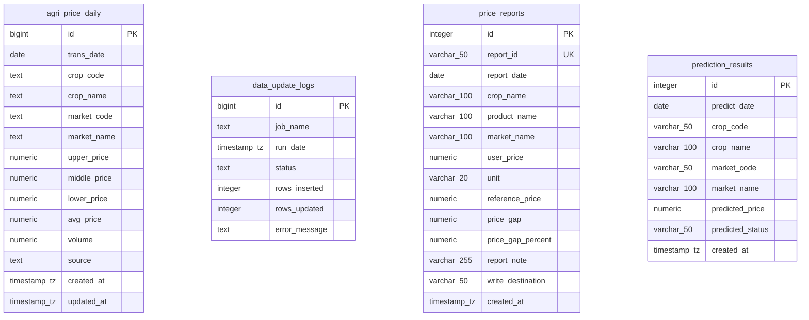

# 資料庫現況盤點說明書 (Database Current State)

本文件盤點目前 SmartBuy AI 專案在 Supabase 雲端 PostgreSQL 中已建立的核心資料表結構、欄位型別、主鍵與唯一鍵約束，以及相關索引規劃。

---

## 1. 資料庫 ER 架構與現存資料表

目前 Supabase 共建立了 4 張核心資料表：

---

## 2. 各資料表詳細結構

### 2.1. `agri_price_daily` (農產品每日交易行情)
* **用途**：存放最新 1~3 個月的每日官方交易行情，作為價格搜尋、採買推薦、天氣預警分析的核心線上資料。
* **資料保留政策**：線上僅保留 90 天內資料，由每日更新腳本自動清理過期資料，完整歷史行情則保留於本機 Parquet 數據湖。
* **欄位結構**：
  * `id` (`bigint`): 主鍵，自動遞增。
  * `trans_date` (`date`): 交易日期（非空）。
  * `crop_code` (`text`): 作物代號。
  * `crop_name` (`text`): 作物名稱（非空）。
  * `market_code` (`text`): 市場代號。
  * `market_name` (`text`): 市場名稱（非空）。
  * `upper_price` (`numeric`): 上價。
  * `middle_price` (`numeric`): 中價。
  * `lower_price` (`numeric`): 下價。
  * `avg_price` (`numeric`): 平均價。
  * `volume` (`numeric`): 交易量。
  * `source` (`text`): 資料來源，預設為 `'MOA_FarmTransData'`（農業部農產品交易行情 API）。
  * `created_at` / `updated_at` (`timestamp with time zone`): 建立與更新時間，預設為 `now()`。
* **約束與索引**：
  * **主鍵**：`agri_price_daily_pkey` ON `id`
  * **唯一約束**：`uq_agri_price_daily` ON (`trans_date`, `crop_code`, `market_code`)。用以確保同日、同作物、同市場只有一筆記錄，同時作為 UPSERT (ON CONFLICT) 的主要索引。
  * **索引**：`uq_agri_price_daily`

### 2.2. `prediction_results` (AI 預測結果展示)
* **用途**：存放由 ML 模組產出的農產品未來行情預測結果，提供前台搜尋頁展示。
* **欄位結構**：
  * `id` (`integer`): 主鍵，自動遞增。
  * `predict_date` (`date`): 預測日期（非空）。
  * `crop_code` (`varchar(50)`): 作物代號（非空）。
  * `crop_name` (`varchar(100)`): 作物名稱。
  * `market_code` (`varchar(50)`): 市場代號（非空）。
  * `market_name` (`varchar(100)`): 市場名稱。
  * `predicted_price` (`numeric`): 預測價格。
  * `predicted_status` (`varchar(50)`): 漲跌趨勢狀態（如 `'cheap'`, `'normal'`, `'expensive'`）。
  * `created_at` (`timestamp with time zone`): 寫入時間，預設為 `now()`。
* **約束與索引**：
  * **主鍵**：`prediction_results_pkey` ON `id`
  * **唯一約束**：`prediction_results_predict_date_crop_code_market_code_key` ON (`predict_date`, `crop_code`, `market_code`)。確保同日、同品項、同市場僅有一筆預測。
  * **額外索引**：
    * `idx_prediction_results_date` ON `predict_date` (加速今日與未來日期的篩選)。
    * `idx_prediction_results_crop` ON `crop_code` (加速特定作物的預測查詢)。

### 2.3. `price_reports` (使用者買貴通報)
* **用途**：記錄使用者回報的市場實際零售價格，並與當日官方行情比對。
* **欄位結構**：
  * `id` (`integer`): 主鍵，自動遞增。
  * `report_id` (`varchar(50)`): 通報流水號，唯一鍵（非空）。
  * `report_date` (`date`): 通報日期（非空）。
  * `crop_name` (`varchar(100)`): 官方作物名稱。
  * `product_name` (`varchar(100)`): 使用者輸入之品項名稱（非空）。
  * `market_name` (`varchar(100)`): 通報交易市場/地點（非空）。
  * `user_price` (`numeric`): 使用者購買價格（非空）。
  * `unit` (`varchar(20)`): 計價單位，預設為 `'元/公斤'`（非空）。
  * `reference_price` (`numeric`): 官方對比價格，查無時為 `NULL`。
  * `price_gap` (`numeric`): 與官方行情之差價，查無時為 `NULL`。
  * `price_gap_percent` (`numeric`): 價差百分比，查無時為 `NULL`。
  * `report_note` (`varchar(255)`): 通報備註，預設為 `'待確認'`。
  * `write_destination` (`varchar(50)`): 寫入目標位置，用以區分資料儲存是實體在 `"Supabase"` 還是 `"本機 CSV"`。
  * `created_at` (`timestamp with time zone`): 通報時間，預設為 `now()`。
* **約束與索引**：
  * **主鍵**：`price_reports_pkey` ON `id`
  * **唯一約束**：`price_reports_report_id_key` ON `report_id`
  * **額外索引**：
    * `idx_price_reports_date` ON `report_date`
    * `idx_price_reports_product` ON `product_name`

### 2.4. `data_update_logs` (每日更新紀錄)
* **用途**：記錄後台排程資料抓取與 Parquet / Supabase 資料同步任務的狀態與筆數。
* **欄位結構**：
  * `id` (`bigint`): 主鍵，自動遞增。
  * `job_name` (`text`): 任務名稱（非空）。
  * `run_date` (`timestamp with time zone`): 執行時間，預設為 `now()`。
  * `status` (`text`): 任務狀態（如 `'success'`, `'failed'`）（非空）。
  * `rows_inserted` (`integer`): 新增筆數，預設為 `0`。
  * `rows_updated` (`integer`): 更新筆數，預設為 `0`
  * `error_message` (`text`): 錯誤訊息，若執行失敗則記錄詳細例外內容。
* **約束與索引**：
  * **主鍵**：`data_update_logs_pkey` ON `id`

---

## 3. 資料與環境邊界劃分

目前專案運作時明確劃分了線上雲端、本機 Parquet 與備援 CSV 三種不同的資料儲存定位：

1. **Supabase 正式 App 線上資料**
   * 當資料庫連線正常時，前台（搜尋頁、首頁、通報頁）全部直接存取 Supabase 中的 `agri_price_daily`、`prediction_results`、`price_reports` 實體表。
   * 資料來源標記為 `"Supabase"`。
2. **本機 Parquet 歷史資料 (ML 數據湖)**
   * 存放在 `data/history_parquet/` 目錄下。
   * **定位**：用來保存長達數年的原始交易大數據，作為機器學習模型離線訓練的核心特徵庫。
   * **優勢**：可避免大量頻繁查詢 Supabase 造成容量超額或連線瓶頸。
3. **本機 CSV 備援 / 測試資料**
   * 存放在 `data/processed/` 或 `data/reports/`。
   * **定位**：作為離線開發、單元測試、以及 Supabase 故障時的 fallback 備援副本。
   * **目前檔案**：
     * `data/processed/market_prices.csv`：供 `price_repository.py` fallback。
     * `data/reports/price_reports.csv`：供 `report_repository.py` fallback。
     * `data/processed/prediction_results.csv`：供 `prediction_repository.py` fallback（手動驗證展示用測試資料）。
